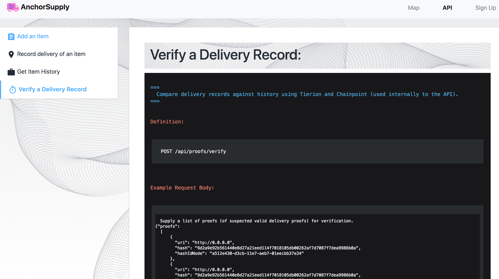

AnchorSupply
---

<b>Check the `README.md` files in each subfolder for more information.</b>

### Concept:

Record GrowNYC supply chain transactions on the blockchain and have them visualized on a google map in real time. Use chainpoint proofs to prove that a particular item/product was at a location at a given point in time. (GrowNYC, Chainpoint)

Biggest problems:
Traceability - being able to answer questions such as where did this case of strawberries come from.
Manual work - a lot of manual effort is spent recording and piecing together history for particular items.

Use the Tierion API to perform delivery validation. I should be able to query on a particular item and get a linked list of that items history that is validated on Tierion and the BTC blockchain.

### Structure

<ul>
<li><b>/server</b>: Server and api for submitting scheduling data.</li>
<li><b>/client</b>: Client side reactjs website</li>
<li><b>/screenshots</b>: Screenshots of app</b></li>  
</ul>

### Screenshots

    <h3>AnchorSupply Home Page</h3>
        
    <h3>Detailed Routing (Expanded View)</h3>
        
    <h3>Map Route Page showing 50 jobs (pickup/delivery pairs)</h3>
        
    <h3>API Documentation</h3>
        
    <h3>API Documentation (Detailed View)</h3>
        
    <h3>Mobile App Screenshots</h3>
        
        

### TODO:

* Create Logo. X
* Update pitch deck in drive folder. X
* Create API documentation. Understand the api interfaces and json body formats. X
* Finish 3 core API routes: add port, add job, query schedule.X
* Add master google maps page to website. X
* Research - what is the schedule data format that ports use. What kind of data will we most likely have access to, and how can this be inserted into this framework for pathfinding: https://github.com/mapbox/node-or-tools X
* Create basic marketing website UI design / or use framework that allows plugging in an API doc page. X
* Add tests to server code and routing. X
* Check jobs table for duplicates. X

### Dev Notes
<b>Check the `README.md` files in each subproject for how to start services.</b>